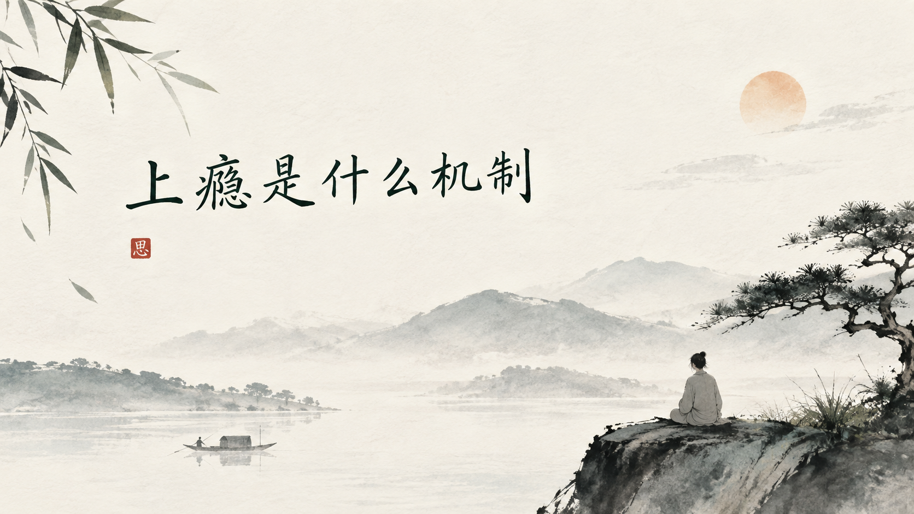

+++
title = "上瘾是什么机制"
date = "2026-10-05T14:40:56+02:00"
categories = ["自省集"]
tags = []
draft = false
+++

人是很容易上瘾的动物。

有时候我们甚至不知道自己是什么时候开始的。最初只是随手拿起手机看一眼，后来变成睡觉前一定要刷一会儿；最初只是偶尔吃一点甜食，后来每天下午到了那个时间，身体就会自动想起它；最初只是想看一集电视剧，等回过神来，已经凌晨一点。

最奇怪的并不是我们喜欢这些东西，而是明明已经不怎么快乐了，却还是会继续。

这大概就是“上瘾”最让人着迷的地方。

它并不完全等于喜欢。

喜欢是一种享受，而上瘾有时候恰恰发生在享受已经减少以后。

从神经科学的角度看，大脑里有一套非常古老的奖赏系统。多巴胺经常被称为“快乐物质”，其实这个说法并不准确。它更像一种“值得注意”“还要继续”的信号，尤其参与了期待、动机和奖励预测。

比如你刷手机，并不是每一次都会看到有趣的东西。真正让人不断打开手机的，往往恰恰是那种“不知道下一次会看到什么”的期待。

可能是一条新消息。

可能是一条让你感兴趣的视频。

可能是一件好笑的事情。

也可能什么都没有。

但正因为不知道下一次会发生什么，大脑反而更容易保持期待。

赌场最厉害的地方，并不是每一次都赢钱，而是你不知道下一次会不会赢钱。

社交媒体也有一点类似的机制。

这一次刷到无聊的东西，下一次也许就是一个特别喜欢的视频；这一次没有人给你点赞，下一次可能突然有很多人回应。

这种不确定的奖励，会让大脑不断学习：“再试一次。”

于是慢慢形成一个循环。

触发。

期待。

行动。

奖励。

再期待。

最后甚至不需要奖励本身，那个触发物就足够让你行动了。

手机放在桌上，你会拿起来。

经过便利店，你会想买东西。

到了晚上某个时间，你会自动打开某个软件。

甚至某一个人发来的消息，都可能成为一种触发。

这时候，事情已经从“我想做”慢慢变成了“我习惯做”。

这也是为什么戒掉一些东西，比我们想象中困难。

因为你以为自己是在和欲望斗争，其实很多时候是在和已经写进生活里的路径斗争。

大脑很喜欢走熟悉的路。

如果每天晚上十点刷手机，刷了几个月以后，“十点”本身就可能成为一个信号。你还没有觉得无聊，手已经伸过去了。

这不是意志力突然消失了。

而是大脑在不断学习环境与行为之间的关系。

更麻烦的是，长期重复某种刺激以后，大脑还会逐渐适应。

同样的东西，第一次可能带来很强烈的满足，后来越来越平淡，于是人会自然地增加剂量、增加频率，或者寻找更强的刺激。

这就是所谓的耐受。

于是一个很有意思的悖论出现了：

我们以为自己是在不断追求快乐，实际上有时候是在努力恢复第一次得到快乐时的感觉。

可第一次永远回不来了。

于是人不断追。

追更甜的食物，更刺激的视频，更强烈的游戏，更快的消息反馈，更大的消费，更激烈的情绪。

最后真正上瘾的，可能已经不是那个东西，而是“期待下一次满足”的感觉。

所以我越来越觉得，上瘾并不是一个简单的“自制力差”。

如果一个人只是告诉自己“你怎么这么没毅力”，其实没有解决任何问题。

因为上瘾最厉害的地方，就是它会让一个短期的满足，去战胜一个长期的道理。

我们都知道熬夜不好。

知道手机看太久不好。

知道甜食吃多了不好。

知道很多事情再继续下去会让自己付出代价。

可是这些“知道”，发生在理性的未来里；而眼前的那个刺激，却发生在此时此刻。

人的大脑天生就比较容易重视眼前的奖励。

明天的健康很遥远。

现在这一口甜食却就在嘴边。

一个月后的精力很遥远。

现在这条视频却已经开始播放。

于是很多所谓的自控，其实都是一个成年人在和自己的大脑谈判：

我知道你现在想要。

但我不一定现在给你。

这句话听起来简单，却是一个人逐渐夺回自由的开始。

真正有效的改变，很多时候也不是每天咬牙坚持，而是改变那些触发行为的环境。

想少刷手机，就不要让手机永远躺在手边。

想少吃零食，就不要让零食成为厨房里最容易拿到的东西。

想少看短视频，就不要在最疲惫的时候把自己交给算法。

因为一个疲惫的人，往往不是没有意志力，而是已经没有多少意志力可以使用了。

到了中年以后，我越来越相信一个道理：

不要总是高估自己的意志力，也不要总是低估环境的力量。

一个人每天面对几十次诱惑，然后要求自己每一次都战胜它，未免太辛苦了。

真正聪明的办法，是让诱惑少出现几次。

可是说到这里，上瘾这件事情还有一个更深的地方。

为什么有些人特别容易上瘾？

因为很多时候，人真正想要的并不是那个东西。

一个孤独的人不停刷手机，未必真的喜欢手机。

一个压力很大的人不停吃东西，未必真的饿。

一个心里空荡荡的人不停购物，也未必真的需要那些东西。

我们有时候不是在追求快乐，而是在逃避某一种不舒服。

无聊的时候，需要刺激。

焦虑的时候，需要转移。

孤独的时候，需要陪伴。

失落的时候，需要一点即时的安慰。

于是某种行为慢慢变成了情绪的止痛药。

这可能才是上瘾最值得我们警惕的地方。

因为当一个东西开始承担“让我不要难受”的任务以后，我们就很容易越来越依赖它。

真正需要解决的，也许已经不是那个行为，而是行为下面那个没有被看见的情绪。

一个人如果只是强迫自己“不许刷”，却从来没有问过“我为什么这么想刷”，很可能只是把一个出口堵住了。

而压力、孤独、空虚仍然在那里。

它迟早还会寻找另一个出口。

所以我现在觉得，所谓戒掉一个习惯，并不只是把它从生活里拿走。

更重要的是，重新给自己找一些东西。

散步。

读书。

写东西。

运动。

和真正喜欢的人说说话。

去看一片风景。

甚至什么都不做，只是让自己安静地坐一会儿。

这些事情的共同点，是它们没有那么快给你奖励。

可也正因为如此，它们不会那么容易把你绑住。

真正好的生活，可能恰恰需要一些“不那么刺激”的东西。

一顿慢慢吃完的饭。

一本读了很久的书。

一条走了很多遍却依然愿意走的路。

一个没有消息弹出来的晚上。

这些事情在算法眼里可能毫无价值，因为它们不能让你停留更久。

可对于一个人来说，它们却可能慢慢把注意力还给自己。

我以前总觉得，自由就是想做什么就做什么。

后来才发现，真正的自由也许恰恰相反。

是你想做一件事情的时候，可以做；不想做的时候，也能够停下来。

你拿起手机，是因为你真的有事情要做，而不是因为手已经习惯了寻找它。

你吃东西，是因为饿了，而不是因为心里有一个洞。

你打开电脑，是因为你想看，而不是因为安静下来以后，你不知道该面对什么。

到了这个时候，一个人才算慢慢从“被刺激牵着走”，回到了自己的生活里。

上瘾最可怕的地方，从来不是让我们喜欢上一件东西。

而是有一天，我们忽然发现，自己已经不再选择了。

手自己伸出去。

脚自己走过去。

时间自己消失。

而我们站在那里，甚至还以为这是自己的决定。

所以有时候真正需要戒掉的，并不只是手机、甜食、游戏或者某一种习惯。

我们需要重新夺回的，是自己的注意力。

因为一个人的注意力放在哪里，他的一部分生命就在哪里。

如果每天都有无数东西争抢你的注意力，那么它们最终争抢的，其实不是你的时间。

是你的一生。

而所谓自律，也许并不是把自己变成一个没有欲望的人。

而是在欲望出现的时候，仍然能够安静地问自己一句：

我是真的想要这个东西，

还是我只是已经习惯了想要它？

这两者之间，看起来只差一点。

可一个人真正的自由，往往就藏在这一点里面。
