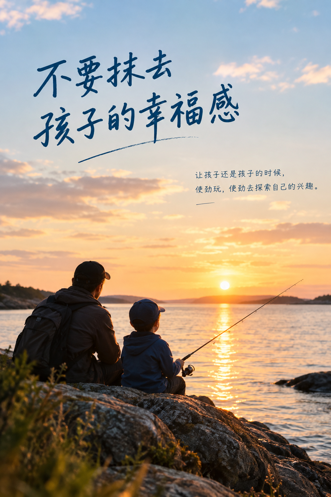

+++
title = "不要抹去孩子的幸福感"
date = "2026-09-20T15:30:31+02:00"
categories = ["亲子集"]
tags = []
draft = false
+++

中年的我，在工作的闲暇时间里，常常发呆，无所事事。

如果我喜欢这种状态，那当然无可厚非。但事实上，很多时候，这恰恰是我彷徨无措、自省过头的状态。

据说，童年的伤，需要人的一生去治疗。我想，我当前眉心里的那颗子弹，也许是儿时的我，早早就预定好的。

我儿时的家庭极其贫困，所有的时间，几乎都用在了学习上。

学习是那么天经地义的一件事情，以至于一旦不去学习，便会产生一种强烈的负罪感。学习确实改变了我的生命轨迹，它让我走出了原来的生活，也让我拥有了今天的一切。

可是到了中年，我依然可以学习，却再也做不到像小时候那样，长时间心无旁骛地学习。

而一旦不学习，或者没有专心学习，失落、困惑、自责，便会慢慢席卷而来。

也许，我心中从来没有一个清晰的“幸福感”定义，所以也从未真正追寻过它。

可即使现在想去追寻，去寻找，一个人又该怎样找回自己从未拥有过的东西呢？

没有得到过，又何谈失去？

直到我看见在北欧长大的孩子，我似乎才有了一些明悟。
	
我的儿子喜欢钓鱼。

他会花费大量的时间，去追逐海岸、河岸，寻找一个适合钓鱼的地方。作为一个中国式思维长大的父亲，我常常会劝他：把这些时间用来学习吧。

可在北欧，学校的上课时间相对较短，孩子们拥有大量可以自己支配的闲暇时间。加之教育方式相对柔性，孩子身上往往还保留着一种天然的野性——他们有自己的兴趣，有自己的节奏，也有自己的判断。

所以，我那些“要好好学习”的话，他们基本只听半句，然后继续自行其是。

孩子曾经对我说：

**“不钓鱼的人，永远不知道鱼咬钩的时候，会带来什么样的幸福感。”**

我听到这句话的时候，忽然愣了一下。

原来，一个孩子已经知道什么是幸福。

不是“将来考上什么学校”，不是“以后能赚多少钱”，甚至不是“别人觉得你应该成为什么样的人”。

而是，当鱼咬钩的那一瞬间，他知道自己为什么站在那里。

他知道自己喜欢什么，也知道自己为什么喜欢。

这大概就是幸福感最朴素的模样。

于谦大爷不是也说过么：

**“我钓鱼怎么了！”**

一个拥有幸福感的人，长大以后，也许更容易找到自己真正想要的东西。

因为他很早就知道，什么事情会让自己感到快乐。

他未必目标远大，却知道自己在追逐什么；未必时时成功，却不会轻易迷失。

这种感觉，我想，就是一种难得的自洽。

曾经有一个荷兰朋友对我说：

**“让孩子停留在孩子的时期，越长越好。因为他们有足够的时间变成大人。”**

这句话我一直记得。

是的。

当一个孩子笑起来的时候，如果他的眼睛里有星星，就不要急着把星星换成石头。

	“石头”也许沉重，也许坚硬，也许能够让一个人变得更加“有用”。

但石头，是坠落的星星。

而一个拥有幸福感的孩子，是一颗不会轻易坠落的星星。

所以，基于我自身的所造、所遇，也基于我走到中年以后，对自己的一些回望，我想诚恳地向父母们说一句：

**不要抹杀孩子的幸福感。**

当孩子还是孩子的时候，让他使劲玩，使劲探索自己的兴趣。

让他去钓鱼，去爬树，去追逐昆虫，去捡石头，去画一些大人看不懂的画，去做那些在成年人眼里“没有意义”的事情。

哪怕这些兴趣，看起来并不能给他带来将来赚钱所需要的技能。

因为一个孩子真正需要学习的，并不只是知识和技能。

他还需要知道，自己喜欢什么；需要体验快乐从哪里来；需要在没有功利目的的事情里，慢慢建立自己的情感世界。

这些东西，也许不会出现在成绩单上，却可能会陪伴他一生。

一个小时候能够因为一条鱼咬钩而开心的孩子，长大以后，也许依然能够因为一场旅行、一首音乐、一本书、一片落叶，甚至一顿和家人一起吃的晚饭而感到幸福。

而一个从小只知道“应该做什么”的孩子，长大以后，可能反而需要花很长的时间，去学习一件最简单的事情：

**我到底喜欢什么？**

人生是一场修行。

真正能够折磨“本我”的，很多时候恰恰是那个无法控制的自我。

它会焦虑，会比较，会怀疑，会自责，会不停地问：

“我是不是还不够好？”

“我是不是还应该再努力一点？”

“如果我现在停下来，是不是就意味着我在退步？”

可是，如果这个不可控的自我，能够在很早的时候，就确切地知道自己想追逐什么样的幸福，知道什么事情能够让自己发自内心地快乐，那么成年以后，它也许就不会那么容易迷失。

因为它知道自己从哪里来，也知道自己要到哪里去。

这或许就是所谓的自洽。

不是让自己变得完美，也不是让自己永远快乐，而是能够让自己的内心、欲望、现实和行动之间，逐渐达成一种不再互相撕扯的状态。

自我与本我之间，慢慢从对抗走向和解。

而这种和解，也许正是“天人合一”之前，一个人能够抵达的最朴素的状态。

所以，别急着让孩子成为一个优秀的大人。

先让他好好做一个孩子。

让他知道，阳光是温暖的，河水是可以蹚过去的，鱼咬钩的时候心会跳得很快，奔跑会让人开心，喜欢一件没有用的事情，本身就是一件很有意义的事情。

因为有一天，他终究会成为大人。

而那个时候，他有足够的时间去学习如何面对世界。

但童年只有一次。

**不要在孩子还没有学会寻找幸福的时候，就先替他定义幸福。**

**不要抹去孩子眼睛里的星星。**

