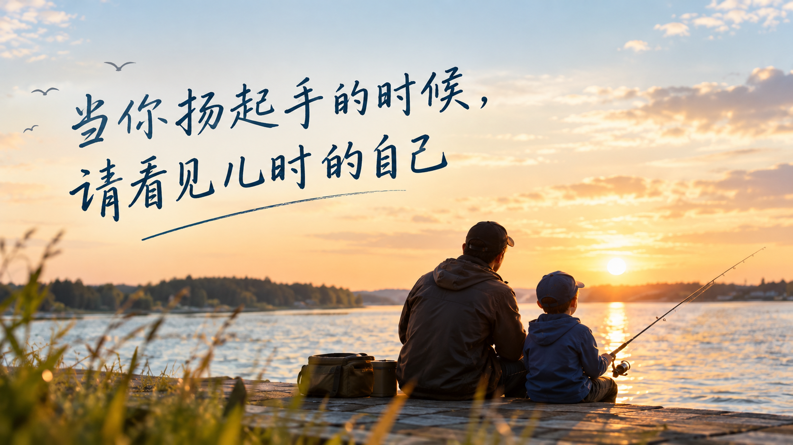

+++
title = "当你扬起手的时候，请看见儿时的自己"
date = "2026-09-20T15:30:31+02:00"
categories = ["亲子集"]
tags = []
draft = false
+++

当你扬起手的时候，请看见儿时的自己

我常常回味韩剧里的那些飙泪桥段。

小心翼翼的父母，对着年幼的孩子说：

“我们也是第一次做父母啊。如果有做得不周到的地方，请你担待。”

每每看到这里，心里总会有些酸。

是的，做了父母的我们，也许内心深处依然还是一个孩子。

我们并没有因为成为父母，就突然变得成熟、睿智、完美。我们也有做对的时候，也有做错的时候；有耐心的时候，也有控制不住脾气的时候。

只是孩子没有选择父母的权利，而我们却有机会重新学习，如何成为一个父母。

行至中年的我，开始慢慢回头看自己，也看自己的孩子。稍作总结，愿看官驻足细思。

当孩子做不出你觉得最简单的一道题；

当孩子早上刚穿上的、昨天才买的新衣服，不一会儿便沾满了泥点；

当孩子疯疯闹闹，一不小心打翻了刚刚做好的、满满一盆全家人都爱吃的汤；

当你工作了一天，疲惫不堪，回到家又面对孩子的一地狼藉；

诸如此类。

如果这时候，怒火冲上头顶，你扬起手，准备给孩子来这么一下子——

我真想冲上去，拦住你的手：

贤弟、弟妹，不可！

你面前站着的这个孩子，就是儿时的你。

你真的忍心把这一巴掌打在儿时的自己身上吗？

孩子无论多么不小心，多么调皮，多么不听话，都不应该成为成年人诉诸武力的理由。

教育需要耐心，需要沟通，需要规则，也需要父母一次又一次地控制自己的情绪。

武力从来没有重塑一个孩子的魔力。

它更多时候，只会让孩子学会一件事情：

当我无法说服别人时，我可以使用力量。

而这恰恰是我们最不希望孩子学会的东西。

有些父母可能会说：

“孩子不打不成器。”

中国有句老话，叫“棍棒底下出孝子”。

如果真是这样，那么我倒想问一句：

这个孩子如果没有挨那些棍棒，是不是反而可能成长得更好？

传统社会有传统社会的秩序。

皇权、夫权、父权，曾经构成了一整套等级森严的社会结构。年幼者服从年长者，妻子服从丈夫，子女服从父母。

“刑不上大夫”，本身就是一种身份和等级的体现。

可今天，我们已经越来越清楚地认识到：一个人的尊严，并不会因为他年龄小而减少。

孩子不是父母的私有财产。

父母拥有的是抚养、教育和保护孩子的责任，而不是任意支配孩子身体的权力。

如果一定要借用古代的说法，那么孩子倒更像是家里的“储君”“公主”——不是因为他们高贵，而是因为他们弱小、尚未成熟，需要被保护，需要被教育，需要被等待着长大。

而不是需要被“刑罚”。

事实上，这并不只是现代人的一种育儿理念。

一些国家已经直接把这种观念写进了法律。

例如瑞典，法律明确规定，监护人有责任保证孩子得到照料、安全和良好的成长环境，儿童不得受到身体上的体罚或者其他侮辱性待遇。

德国法律也明确规定，儿童有权在没有暴力、身体惩罚、精神伤害以及其他侮辱性措施的情况下接受照料和教育。

挪威的儿童法同样明确规定，孩子不得遭受暴力；即使暴力是以“教育孩子”为目的，也不被允许。

这些法律的意义，并不是要把父母变成不能管孩子的人。

恰恰相反。

它是在重新定义一件事情：

父母可以管教孩子，但管教不等于拥有伤害孩子身体的权力。

孩子做错了事情，父母当然可以制止，可以批评，可以设定规则，可以让孩子承担与年龄相适应的后果。

但“我生了你，所以我可以打你”，这套逻辑已经越来越不被现代社会所接受。

因为父母与孩子之间天然存在巨大的力量差距。

成年人拥有身体力量、经济能力、知识、社会资源和话语权，而孩子什么都没有。

当一个成年人利用这种不对等的力量去打一个无法与自己抗衡的孩子时，问题已经不只是“教育方式好不好”的问题。

而是：

我们究竟认为自己对一个弱小的人拥有怎样的权利？

偶尔打一下孩子，也不应该被认为是“没什么”。

因为你可能会发现：

你因为暴怒，偶尔打了孩子，推了那么一把，踹了那么一脚，抡了那么一下。

事情过去了。

孩子可能不再哭了。

甚至第二天还会照常跑过来找你。

于是你觉得：

“没事，他忘了。”

可孩子真的忘了吗？

也许没有。

而且很多时候，你自己也不会忘。

过了很多年，甚至几十年以后，你仍然可能突然想起来：

当时为什么那么冲动？

明明只是一个大不了的事情。

明明孩子只是把汤打翻了。

明明一道题不会做而已。

明明衣服脏了洗洗就好了。

为什么当时的自己，就一定要把那一巴掌打下去？

那时候你可能已经忘了孩子为什么挨打，却记得自己曾经伤害过他。

而孩子也可能忘记那天到底发生了什么，却记得：

爸爸妈妈生气的时候，会打我。

如果经常打孩子，问题就更加严重。

体罚并不是一种中性的教育手段。

一个长期生活在暴力中的孩子，可能逐渐变得极度自卑，不敢表达自己的需求，不敢反抗，习惯讨好别人；也可能走向另一个方向，把暴力理解为解决冲突的正常方式。

小时候无法反抗父母，长大以后，他可能把这种积累带向自己的亲密关系，甚至带向下一代。

于是，暴力成为一种代际循环。

父亲打儿子，儿子长大以后打自己的孩子。

上一代说：

“我也是这么被打大的。”

下一代又说：

“大家不都是这么过来的吗？”

一代一代，竟然把伤害包装成了传统。

而这种循环最可怕的地方就在于：

被伤害过的人，最后可能学会了如何伤害别人。

如果一个人年老以后，在孩子的冷言冷语甚至拳脚中度过晚年，那么回头看，也许才会真正明白：

当年那个扬起的手，改变的可能不只是一瞬间的亲子关系。

如果你觉得体罚孩子是稀松平常的事情，那么我想问一句：

你的童年，是不是也曾经生活在这样的阴影里？

如果是。

那就更应该停下来想一想。

既然你亲历过它的痛，为什么还要把同样的痛加诸于自己最爱的孩子？

难道不是因为我们小时候缺少保护，所以今天才更应该成为孩子的保护者吗？

我们没有办法改变自己的童年。

但我们可以决定：

伤害到我这一代，就到此为止。

年轻的父母，火气大一些，也许更容易发脾气。

工作累了，孩子又闹；

睡眠不足，孩子又犯错；

自己小时候就是被这样教育过来的，于是到了自己的孩子身上，也很容易条件反射般地重复。

作为过来人，中年的我想劝君三思。

真正考验父母的，从来不是孩子乖的时候。

孩子安安静静坐在那里写作业，你当然可以温柔。

孩子考试考了第一名，你当然可以拥抱。

真正考验父母的，是孩子把牛奶打翻、把衣服弄脏、把饭菜弄洒、把你气得火冒三丈的时候。

这才是爱的时刻。

你能不能在最愤怒的时候，仍然不伤害他？

你能不能在想扬手的时候，把手放下来？

你能不能先深呼吸一下，然后蹲下来，看着他的眼睛，告诉他：

“你刚才做错了，我们一起想办法。”

我想，这才是父母真正的修行。

被揍大的孩子，很难成为我们口中的如玉君子、世间无双，也未必更容易成为智者、医者、师者。

至少，棍棒本身从来不是通往这些地方的捷径。

而当你真正观察过一个孩子的成长，就会发现：

人的成长是分阶段的。

每一个阶段，都有属于这个阶段的“天花板”。

你不能期待一个五岁的孩子拥有十岁孩子的理解能力。

更不能拿你四十岁时的知识、经验和人生阅历，去衡量一个五岁孩子为什么还不懂事。

因为他就是不懂。

不是因为他故意要和你作对。

不是因为他天生愚笨。

只是因为他的生命还走到那里。

他的大脑、情绪、认知、语言、控制能力，都还在成长。

所以，一个孩子为什么需要父母？

从某种意义上说，这是人类社会的一种非常伟大的安排。

如果一个高度文明的社会，真的可以建立一个机构，把所有新生儿集中起来，由最专业的人来照料、教育、培养，那么孩子是不是就不需要家庭了？

显然不是。

因为机构可以提供食物、住所、教育和医疗，却很难替代家庭给予孩子的那种爱。

孩子在最羸弱、最无助的时候，需要有人抱着他。

需要有人在他害怕的时候告诉他：

“别怕，我在这里。”

需要有人在他摔倒的时候伸手把他扶起来。

然后，他才一点一点长大。

这可能就是人类几千年来形成家庭的深层原因之一。

孩子不是因为强大才需要父母，而恰恰是因为弱小。

所以，父母拥有的第一权利，应该是保护。而不是伤害。

再过十几年：

当那个曾经打翻牛奶的孩子，不再打翻牛奶；

当那个曾经弄脏衣服的孩子，已经懂得自己把衣服洗干净；

当那个曾经疯疯闹闹的孩子，站在你面前，已经比你高出一个头；

宽宽的肩膀，青春明朗的容颜。

也许有一天，你会突然觉得：

当年停住自己那只手，是多么明智的一件事情。

因为你今天面对的这个年轻人，是你当年保护下来的孩子。

他没有因为小时候被你打过，所以变得更加优秀。

恰恰是因为你在那些本可以伤害他的时刻，选择了克制、沟通和爱，他才有机会带着完整的自尊长大。

而如果这样的孩子是在你的体罚中长大的——

你又将如何面对成年后的他？

说到体罚，我也想讲讲自己的事情。

小学时候的我，成绩不错，很受老师喜爱。

有一次大考，因为审错了题，白白丢了七分。

在今天看来，不过是一场考试中的一个错误。

可当时，我因此受到了老师的体罚。

老师拧我的耳朵。

那只耳朵像皮筋一样，被拧了也许不知道多少圈。当时感觉耳朵都快被拉长了，温热得厉害。

中午放学，排队回家的时候，我摸了一下耳朵眼。

有血流出来。

回家后，父母吓坏了，赶紧领我去村里的赤脚医生那里查看。

限于当时的医疗条件，也没有得到什么有效的处理。

后来的一段时间，那边的耳朵还会时不时流血。

直到父母不知道从哪里觅得一个偏方，把霜打过的柿子蒂在炉子里烧成炭，碾成细粉，混了香油，灌进耳朵里，耳朵才慢慢结痂。

可直到今天，我这边的耳朵依然无法使用入耳式耳机。

一戴，就会感到痛痒，有时候还会流出很多液体。

当年全家也没有真正怪过那位老师。

那是一个年代。

大家都觉得，老师管学生，似乎天经地义。

现在回头想来，却还是会有些心有不平。

一道题错了，为什么需要用身体的伤害来偿还？

一个孩子犯了一个错误，为什么成年人要用疼痛来告诉他：

“你错了。”

其实完全可以告诉他：

“你这道题审错了，下次仔细一点。”

错误本身已经足够成为教育。

为什么还要再加上一份疼痛？

所以，我也想说：

老师同样不可体罚学生。

学校是教育人的地方，而不是让孩子学习服从暴力的地方。

面对幼小的孩子，他们其实就是大人儿时的镜像。

当你看着他们的时候，也是在看曾经的自己。

所以，学会和孩子对话吧。

也学会和儿时的自己对话。

当孩子犯错的时候，不妨问问自己：

如果是小时候的我犯了这个错误，我希望父母怎么对我？

如果是小时候的我把这盆汤打翻了，我希望听到什么？

如果是小时候的我，因为不会一道题而哭泣，我希望有人怎么对我？

也许你会发现：

你真正想给儿时的自己，并不是一巴掌。

而是一个拥抱。

有了孩子的父母，其实应该心怀感恩。

因为孩子不仅仅是在你的养育下成长。

你也会从孩子的成长中，看见自己是怎么长大的。

你会重新遇见那个曾经的自己。

会重新理解自己的父母。

会重新理解童年。

也会重新理解什么叫爱。

如果你能够在对待孩子的过程中，慢慢改变自己，那么孩子改变的也许不只是这一代。

孩子以后会成为父母。

他的孩子，也会从他那里接受爱。

于是，一个人的改变，可能会沿着血脉向后延伸。

反之，伤害也一样。

爱可以成为循环，暴力也可以成为循环。

而变化，有时候只在一念之间。

当你扬起手的时候，停一下。

看看眼前这个孩子。

他也许只是把汤打翻了。

也许只是把衣服弄脏了。

也许只是做错了一道你觉得简单得不能再简单的题。

可你曾经也是这样长大的。

那个小小的、犯错的、笨拙的、需要被原谅的孩子，也曾经是你。

所以，请把手放下来。

然后蹲下来。

看着他的眼睛。

告诉他：

“没关系，我们一起想办法。”

这可能就是父母给孩子最好的教育。

也是我们给自己童年最迟到的一次拥抱。

世之为父母者，不可不察，不可不知也。
